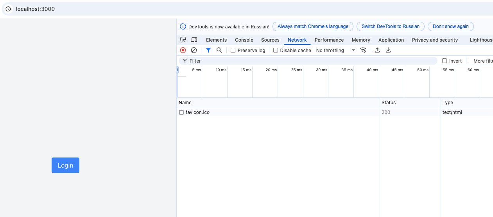
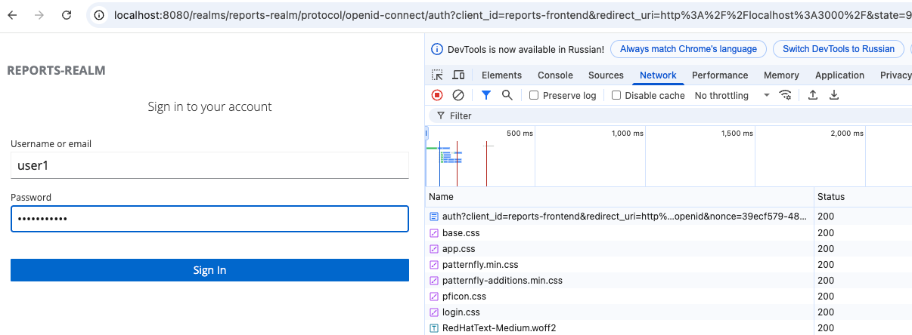
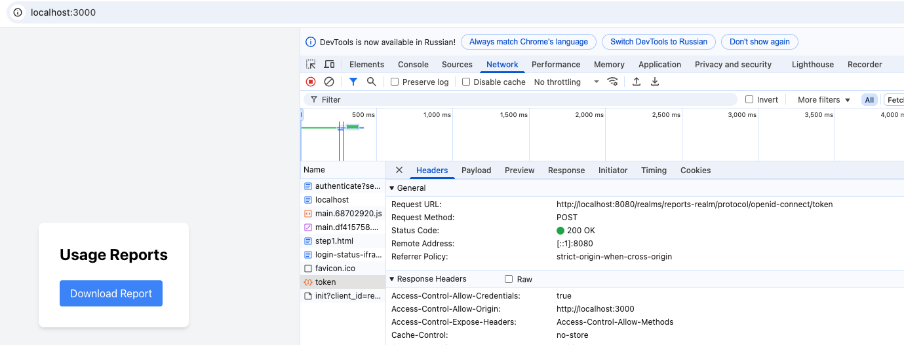
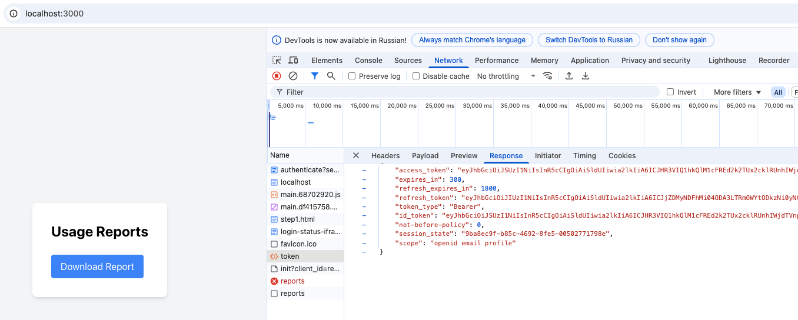
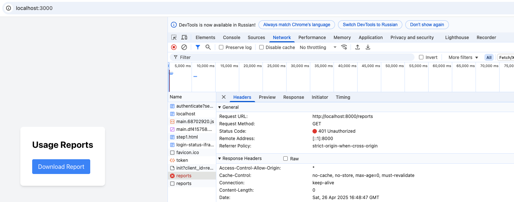
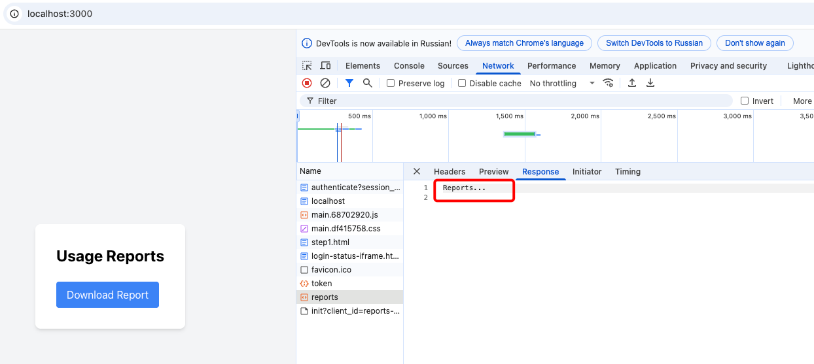

# Single Sign-On авторизация на основе ролей пользователей с использованием keycloak сервиса по протоколу OAuth 2.0.

Single Sign-On позволяет пользователю один раз авторизоваться и получить доступ к разным сервисам без повторного ввода логина и пароля.     
Взаимодействия между сервисами реализовано с использованием протокола авторизции OAuth 2.0.     

При запросе на http://localhost:3000 Frontend перенаправляет пользователя на Keyclok сервис (http://localhost:8080), где пользователь авторизуется.          
Дальнейшие запросы выполняются с access_token, в котором указаны роли пользователя, id_token и refresh_token.            
Backend отдает данные только пользователям с ролью prothetic_user, при этом проверяя access_token из запроса в Keyclok сервисе.              
Настройки пользователей и ролей для Keyclock сервиса авторизации находятся в realm-export.json.     

Пользователь prothetic1 с ролью prothetic_user получает доступ к отчетам.       
